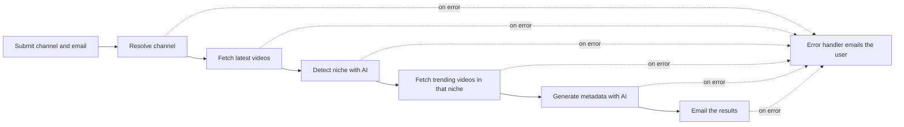

# ReachAI

AI generated YouTube metadata that follows what's trending in your niche.

Live at **[reachaiapp.online](https://reachaiapp.online)**

ReachAI helps YouTube creators get more views from the videos they already have. You enter your channel and email, and it looks at your latest videos, works out your niche, checks what's trending in that niche right now and writes better titles, descriptions, tags and hashtags for each video. The results arrive in your inbox.

## Plans

| Plan | What you get | Price |
| --- | --- | --- |
| Free | Two new title ideas for each of your 5 latest videos | ₹0 |
| Full bundle | Titles, descriptions, tags, hashtags and the reasoning behind them for your 10 latest videos | ₹99 |

Payments go through Razorpay, and the paid workflow only starts once the payment is verified.

## How it works

The backend is built with [Motia](https://motia.dev), an event driven framework where every step is its own small handler. Each step does one job, emits an event when it's done and the next step picks it up. If a step fails, an error handler emails the user instead of leaving the job hanging, and paid jobs can be retried.



The free and paid plans run the same pipeline as two separate flows.

- **Free flow.** `POST /submit` starts the job, and the AI step writes two titles for each of the 5 latest videos.
- **Paid flow.** `POST /api/payment/create-order` creates a Razorpay order. Once the payment is confirmed, either through `POST /api/payment/verify` from the checkout page or through the Razorpay webhook at `POST /api/payment/webhook`, the job runs for 10 videos and generates the full metadata.

The frontend polls `GET /status` to show progress while a job runs. `POST /api/jobs/:jobId/retry` restarts a failed paid job, and `POST /api/contact` sends contact form messages to the support inbox.

## Tech stack

**Backend** (`reachai-backend/`)

- Motia with TypeScript, using the BullMQ plugin for queued events and Motia state for job data
- YouTube Data API v3 for channels, videos and trending results
- OpenRouter (`gpt-4o-mini`) for niche detection and metadata
- Razorpay for orders, payment verification and webhooks
- Resend for emails

**Frontend** (`frontend/`)

- Next.js 16 and React 19 with TypeScript
- Tailwind CSS
- Landing page, checkout, live job status, contact form and legal pages

## Running it locally

You'll need Node.js 20 or newer, plus API keys for YouTube, OpenRouter, Resend and Razorpay (test mode works).

### Backend

```bash
git clone https://github.com/AI-pro017/ReachAI.git
cd ReachAI/reachai-backend
npm install
```

Create a `.env` file:

```env
YOUTUBE_API_KEY=
OPENAI_API_KEY=            # your OpenRouter key
RESEND_API_KEY=
RESEND_FROM_EMAIL=         # sender for result emails
RESEND_FROM_SUPPORTEMAIL=  # sender for contact form emails
MERA_EMAIL=                # inbox that receives contact form messages
FRONTEND_URL=http://localhost:3001
RAZORPAY_KEY_ID=
RAZORPAY_KEY_SECRET=
RAZORPAY_WEBHOOK_SECRET=
```

Start it:

```bash
npm run dev
```

This runs the API on port 3000 and opens the Motia Workbench, where you can watch each flow and its events live.

### Frontend

```bash
cd ../frontend
npm install
```

Create `frontend/.env.local`:

```env
NEXT_PUBLIC_BACKEND_URL=http://localhost:3000
NEXT_PUBLIC_RAZORPAY_KEY_ID=
```

Then start it on a different port from the backend:

```bash
npm run dev -- -p 3001
```

and open http://localhost:3001.

## Project structure

```text
reachai-backend/
  src/freeUser/    Steps for the free flow, status endpoint and contact form
  src/paidUser/    Steps for the paid flow, Razorpay order, verify, webhook and retry
  motia.config.ts  Motia plugins
frontend/
  app/             Pages: home, checkout, thank you, about, contact and legal
  components/      Landing page sections, forms and pay button
  hooks/           Job status polling
docs/
  learning-notes.md  Notes I wrote while building the project
```
